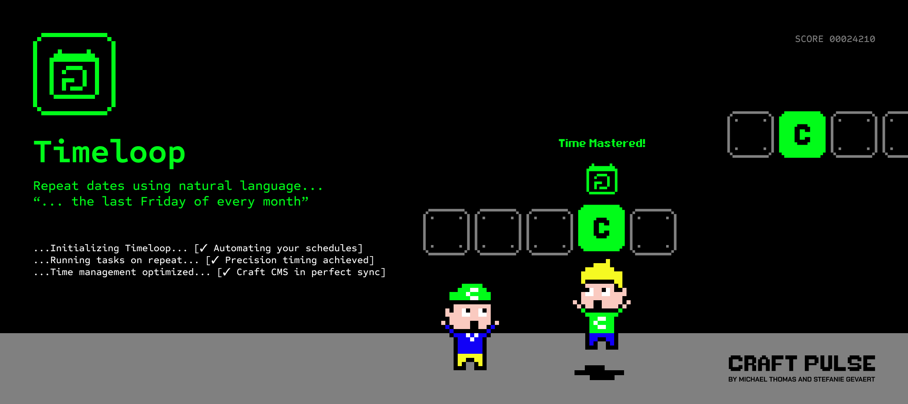

# Timeloop for Craft CMS

Timeloop generates arrays of dates between a start and end date based on a frequency — recurring events, repeating classes, courses, payment schedules — without complex recurrence inputs. Authors pick a start date, a frequency, and an interval; your templates get clean `DateTime` arrays back.



## Features

- **Timeloop field type** — a single field that captures start/end dates, optional start/end times, frequency, interval, and refinements per frequency.
- **Four frequencies** — daily, weekly, monthly, and yearly, each with a configurable interval (every 2 weeks, every 3 months, ...).
- **Weekly day selection** — repeat on specific weekdays, e.g. every week on Monday and Friday.
- **Monthly ordinals** — repeat on the first, second, third, fourth, or last weekday of the month, e.g. "last Saturday of every month".
- **Computed dates in Twig** — `dates`, `upcoming`, and `nextUpcoming` on the field value, plus a `recurringDates()` function to collect dates across a whole element query.
- **Reminder offset** — store a reminder period (e.g. 2 days before) and read the computed reminder date for the next occurrence.
- **GraphQL support** — query the field's raw settings and computed dates, and set the field through mutations.

## Requirements

- Craft CMS 5.0 or newer
- PHP 8.2+

## Installation

In your Craft project root:

```bash
composer require craftpulse/craft-timeloop
./craft plugin/install timeloop
```

Or install through the Plugin Store: **Settings → Plugins → Search "Timeloop"**.

## Setting up the field

Create a new field and pick **Timeloop** as the field type. The field has one setting:

- **Show Times** — when enabled, authors can set a start time and end time alongside the start and end dates. The times are merged into the stored dates (occurrences start at the start time; the loop end date ends at the end time, or 23:59 when no end time is set).

Authors then configure each entry's loop:

- **Start date** (required) — the first occurrence.
- **End date** (optional) — when the loop stops. Without an end date, dates are generated up to 20 years ahead.
- **Loop period** — the frequency (daily, weekly, monthly, or yearly) and the interval between occurrences. Weekly loops can target specific days of the week; monthly loops can target an ordinal weekday (e.g. "last Friday").
- **Reminder** (optional) — a value and unit (days, weeks, months, or years) subtracted from the next occurrence to produce a reminder date. Timeloop computes the date; sending the actual notification is up to your project.

## Templating

The examples below assume an `events` section with a Timeloop field whose handle is `schedule`.

### Getting the computed dates

`dates` returns the upcoming occurrences as an array of `DateTime` objects (future dates only, capped at 100 by default):

```twig

    {{ date | date('d/m/Y H:i') }}

```

Use `getDates()` to control the limit and whether past dates are included:

```twig
{# The next 5 occurrences #}

    {{ date | date('d/m/Y H:i') }}


{# Occurrences from the start date onwards, including past ones (max 100) #}

    {{ date | date('d/m/Y H:i') }}

```

The generated dates take all field values into account: frequency, interval, weekly days, and monthly ordinals.

### Upcoming occurrences

```twig
{# The first upcoming occurrence #}
{{ entry.schedule.upcoming | date('d/m/Y H:i') }}

{# The occurrence after that #}
{{ entry.schedule.nextUpcoming | date('d/m/Y H:i') }}
```

Both return `null` when the loop has no (more) upcoming dates, so guard accordingly:

```twig

    Next class: {{ entry.schedule.upcoming | date('l d F Y') }}

```

### The entered dates and times

The raw field values are available as `DateTime` objects (or `null` when not set):

```twig
{{ entry.schedule.loopStartDate | date('Y-m-d\\TH:i:sP') }}   {# includes the start time #}
{{ entry.schedule.loopEndDate | date('Y-m-d\\TH:i:sP') }}     {# includes the end time #}
{{ entry.schedule.loopStartTime | date('H:i') }}
{{ entry.schedule.loopEndTime | date('H:i') }}
```

### The loop period

`period` returns the recurrence configuration:

```twig
{{ entry.schedule.period.frequency }}   {# ISO 8601 duration: P1D, P1W, P1M or P1Y #}
{{ entry.schedule.period.cycle }}       {# the interval, e.g. 2 for "every 2 weeks" #}

{# Selected weekdays for weekly loops #}

    {{ day }}

```

For monthly loops, `timestring` returns the ordinal weekday configuration:

```twig


    Repeats every {{ timestring.ordinal }} {{ timestring.day }} of the month

```

`timestring` is `null` when no timestring data is stored, and `ordinal`/`day` are the string `'none'` when no selection has been made.

### The reminder date

`reminder` returns the reminder date for the first upcoming occurrence, or `null` when no reminder is configured:

```twig

    Send a reminder on {{ entry.schedule.reminder | date('d/m/Y') }}

```

### Collecting dates across entries

The `recurringDates()` Twig function expands a whole element query into recurring dates within a window — handy for calendars and agenda views. Pass the query, the Timeloop field handle, and a start and end date (boundaries are inclusive):

```twig



    <h2>{{ item.entryTitle }}</h2>
    
        {{ date | date('d/m/y H:i') }}<br>
    

```

Each item contains `entryId`, `entryTitle`, and `dates` (an array of `DateTime` objects within the window, including past dates).

## GraphQL

### Querying

The field exposes the stored settings and the computed dates. Dates support Craft's `@formatDateTime` directive; `loopStartTime` and `loopEndTime` resolve to `H:i` strings.

```graphql
{
  entries(section: "events") {
    title
    ... on event_Entry {
      schedule {
        loopStartDate
        loopEndDate
        loopStartTime
        loopEndTime
        loopPeriod {
          frequency
          cycle
          days
          timestring {
            ordinal
            day
          }
        }
        getDates(limit: 5) @formatDateTime(format: "d/m/Y")
        getUpcoming
        getReminder
      }
    }
  }
}
```

- `loopPeriod.frequency` — the selected frequency (`P1D`, `P1W`, `P1M` or `P1Y`)
- `loopPeriod.cycle` — the interval between occurrences
- `loopPeriod.days` — the selected weekdays for weekly loops
- `loopPeriod.timestring` — the `ordinal` (e.g. `last`) and `day` (e.g. `saturday`) for monthly loops
- `getDates` — the computed dates; accepts `limit` (default `100`) and `futureDates` (default `true`)
- `getUpcoming` — the first upcoming occurrence
- `getReminder` — the reminder date for the first upcoming occurrence

### Mutating

The field can be set through entry mutations. The input type accepts `loopStartDate`, `loopEndDate`, `loopStartTime`, `loopEndTime`, and a `loopPeriod` object:

```graphql
mutation {
  save_events_event_Entry(
    title: "Weekly yoga class"
    schedule: {
      loopStartDate: "2026-09-01"
      loopEndDate: "2027-06-30"
      loopPeriod: {
        frequency: "P1W"
        cycle: 1
        days: ["Monday", "Thursday"]
      }
    }
  ) {
    id
  }
}
```

For monthly loops, pass a `timestring` object with `ordinal` (`First`, `Second`, `Third`, `Fourth`, `Last`) and `day` (e.g. `Saturday`) inside `loopPeriod`. Reminder settings cannot be set through GraphQL.

## Support

- **Plugin Store**: [plugins.craftcms.com/timeloop](https://plugins.craftcms.com/timeloop)
- **Bugs and feature requests**: [github.com/craftpulse/craft-timeloop/issues](https://github.com/craftpulse/craft-timeloop/issues)
- **Email**: support@craft-pulse.com

Brought to you by [CraftPulse](https://craft-pulse.com/).
